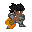
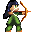
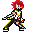
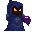
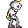

# ⚔️ Intro Battle: O Confronto Final! ⚔️

.png)

Prepare-se, herói! O destino do reino está em suas mãos neste desafiador RPG de turnos clássico! `Intro Battle` mergulha você em combates estratégicos, onde cada decisão conta e a vitória é forjada na inteligência e na força da sua equipe.

## 🚀 Uma Aventura Começa! 🚀

A jornada se inicia no nosso **Menu Principal**, a porta de entrada para a glória! Navegue com as setas do teclado e pressione `Z` para entrar na ação, explorar os `Créditos` ou `Sair` da aventura.

## 🛡️ Monte Sua Equipe Lendária! 🛡️

A estratégia é a chave para a vitória! No **Menu de Seleção de Personagens**, você deve escolher três bravos heróis para compor seu time. Cada um traz habilidades e características únicas para o campo de batalha.

Navegue com as setas, selecione seus campeões com `Z` e prepare-se para a luta! Se mudar de ideia, `X` o levará de volta ao menu principal.

### Conheça Seus Heróis:

| Personagem | HP Base | ATK Base | DEF Base | SPD Base |
| :--------- | :------ | :------- | :------- | :------- |
| **Priest** .png) | 80      | 7        | 8        | 4        |
| **Paladin**  | 90      | 5        | 6        | 1        |
| **Hunter**  | 85      | 6        | 3        | 5        |
| **Wizard** .png) | 80      | 8        | 5        | 1        |
| **Rogue**  | 85      | 10       | 2        | 5        |

* **HP**: Pontos de Vida - O quanto de dano seu herói pode aguentar.
* **ATK**: Ataque - Determina o poder dos seus golpes.
* **DEF**: Defesa - Reduz o dano recebido.
* **SPD**: Velocidade - Define a ordem dos turnos na batalha. Heróis mais rápidos agem primeiro!

## 💥 O Campo de Batalha Te Espera! 💥

Uma vez que sua equipe esteja completa, você será lançado diretamente no coração do combate! `Intro Battle` apresenta um sistema de turnos dinâmico, onde a velocidade dos seus personagens e a dos seus inimigos determinam a ordem das ações.

### Domine o Combate:

* **Turnos Estratégicos**: Cada personagem (e inimigo) age em sua vez, determinada pela estatística de Velocidade.
* **Comandos Essenciais**:
    * **Ataque**: Cause dano ao inimigo selecionado.
    * **Defender**: Reduza o dano recebido no próximo ataque inimigo.
* **Interface Clara**: Acompanhe o HP de todos os participantes do combate e saiba de quem é o turno.
    * **HP do Herói**: Mostrado no painel direito, com o formato `HP Atual / HP Total`.
    * **HP do Inimigo**: Exibido acima de cada inimigo, também no formato `HP Atual / HP Total`.

### Seus Adversários:

| Inimigo  | HP Base | ATK Base | DEF Base | SPD Base |
| :------- | :------ | :------- | :------- | :------- |
| **Witch**      | 75      | 9        | 4        | 3        |
| **Skeleton**  | 70      | 11       | 6        | 4        |

## 🎶 A Trilha Sonora da Sua Aventura! 🎶

A imersão está garantida com uma trilha sonora que se adapta a cada momento da sua jornada:

* **`BoxCat Games - Inspiring.mp3`**: Acompanha você no **Menu Principal**, preparando o terreno para a aventura.
* **`BoxCat Games - Inspiration.mp3`**: Toca durante a **Seleção de Personagens**, inspirando suas escolhas estratégicas.
* **`BoxCat Games - Defeat.mp3`**: A triste melodia da **Derrota**, um lembrete para tentar novamente!
* **`BoxCat Games - Victory.mp3`**: O som triunfante da **Vitória**, celebrando sua maestria!

## 💀 Fim de Jogo: Vitória ou Derrota? 💀

Cada batalha tem um fim. Seja glorioso ou trágico, a tela de **Game Over** aguarda!

* **Vitória!**: Se todos os inimigos caírem perante sua equipe, a glória será sua!
* **Derrota!**: Se seus heróis forem superados, é hora de refletir e tentar uma nova estratégia!

Pressione `Z` para retornar ao Menu Principal e iniciar uma nova saga!

---

## 🛠️ Por Trás das Cenas: Estrutura do Projeto 🛠️

O `Intro Battle` é construído com Pygame, utilizando uma estrutura de classes modular para garantir organização e escalabilidade:

## 💖 Agradecimentos Especiais 💖

Um agradecimento sincero a todos que contribuíram para tornar `Intro Battle` uma realidade! Veja os nomes dos talentosos desenvolvedores, artistas e documentadores na seção de `Créditos` do jogo!

---

**Desenvolvido com `Pygame` e muito carinho!**